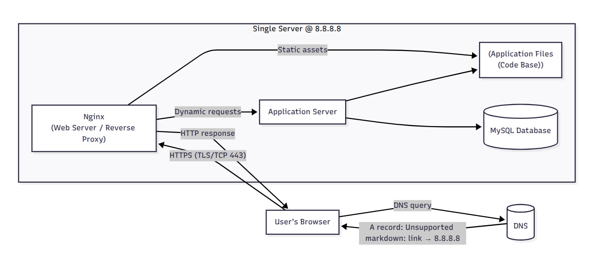

# One-server web infrastructure for www.foobar.com

A user opens their browser and types https://www.foobar.com.

Their computer asks DNS for “www” under foobar.com; DNS returns the server IP 8.8.8.8. The browser connects to that IP (TCP/IP), usually over HTTPS (TLS) on port 443). A firewall on the host allows only necessary ports. The request hits Nginx (web server), which forwards dynamic requests to the application server, which runs your application files (code) and queries MySQL. The response flows back through Nginx to the user’s browser.

## Components and roles
- Server: A single physical or virtual machine running all components (Nginx, app server, code, MySQL).
- Domain name: Human-readable alias (foobar.com) that maps to numeric IPs so users don’t memorize addresses.
- www DNS record type: A record pointing www.foobar.com → 8.8.8.8 (direct host-to-IP mapping).
- Web server (Nginx): Terminates HTTP/HTTPS, serves static files, and reverse-proxies dynamic requests to the app server.
- Application server: Executes your backend code (e.g., Node.js, Gunicorn, uWSGI), applies business logic, formats responses.
- Application files (code base): Your website/app source that the application server runs/loads.
- Database (MySQL): Persists and retrieves structured data for the app.
- Communication with the user: TCP/IP using HTTP (80) or, preferably, HTTPS (TLS on 443) for encryption.

## Issues with this simple setup
- SPOF (Single Point of Failure): One server—if it dies, everything’s down.
- Maintenance downtime: Deploys or restarts (e.g., Nginx, app server, DB upgrades) interrupt service.
- No horizontal scaling: A surge in traffic overwhelms the single box; there’s no load distribution or auto-scaling path.
