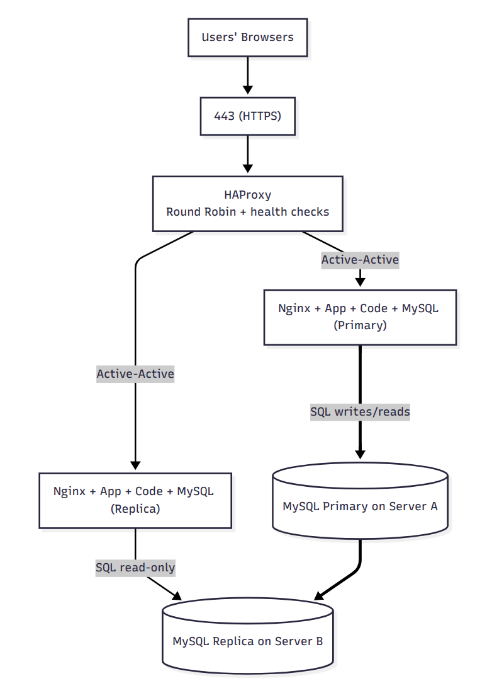

# Distributed web infrastructure

## Infrastructure Components
- HAProxy load balancer: spreads traffic across multiple servers, protects users from a single app node failure, and enables horizontal scaling.
- Two application/web/database servers: add capacity and redundancy; one can keep serving traffic if the other fails.
- Nginx (on each server): terminates HTTP/S and reverse-proxies to the app server; can serve static assets efficiently.
- Application server (on each): runs the business logic.
- Application files (on each): local codebase for low-latency access and simpler deploys.
- MySQL on each: enables a Primary → Replica topology: Server A = Primary, Server B = Replica.

## Load-balancer details
- Algorithm: Round Robin. HAProxy cycles requests across the two backends in order. If a health check fails, the bad node is taken out of rotation until it recovers.
- Setup type: Active-Active for the backend application tier—both servers receive live traffic simultaneously.
  - Active-Active: multiple nodes handle requests at the same time; improves throughput and resilience.
  - Active-Passive: only one node serves; the other sits idle and takes over on failure (lower resource use, slower failover).

## Primary-Replica (Master-Slave) MySQL: how it works
- Replication flow: the Primary writes binlog events; the Replica replays them to mirror data. Default is asynchronous, so the Replica can lag slightly.
- From the app’s perspective:
  - Primary node: used for all writes (INSERT/UPDATE/DELETE) and can serve reads.
  - Replica node: read-only; safe for SELECTs that tolerate slight staleness. If the Primary fails, promote the Replica to Primary (manual or orchestrated), and repoint writers.

## Known issues with this design (by intent)
- SPOFs (Single Points of Failure):
  - The load balancer itself—only one HAProxy instance is shown. If it dies, the site is down despite healthy backends.
  - Primary MySQL—writes depend on a single Primary; failure requires promotion of the Replica.
  - Single region / single DNS record management—if the region or DNS path fails, service impact follows.
- Security gaps: no firewall rules shown between tiers and no HTTPS termination details/certs called out in the servers (LB may pass plain HTTP to backends).
- No monitoring: no health/metrics/alerts (e.g., Prometheus, Grafana, HAProxy stats, MySQL replication lag alerts) are included.