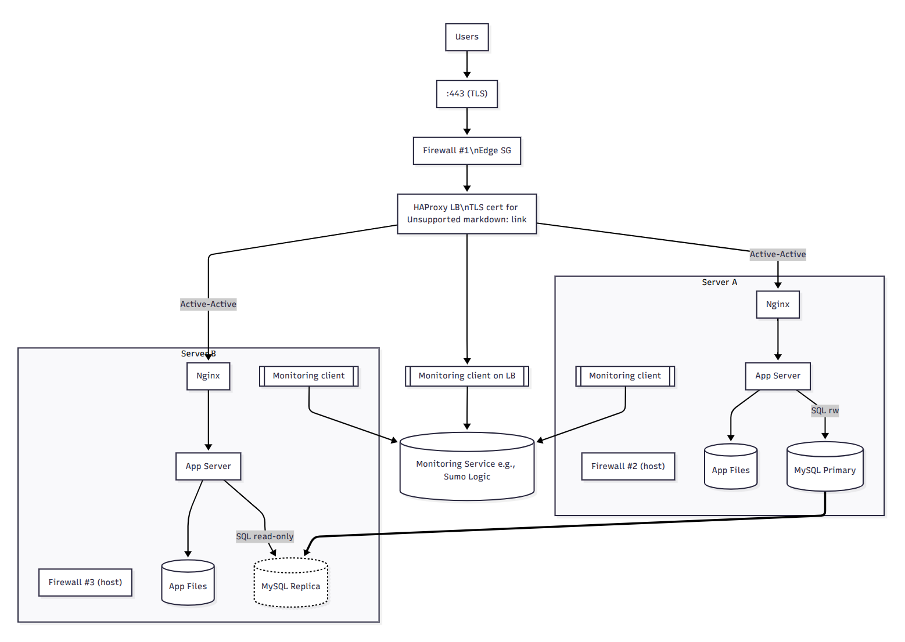

# Secured and monitored web infrastructure

- **Three firewalls**
  - Firewall #1 (edge / security group) – Only TCP 443 from the internet to the load balancer; blocks everything else by default. Purpose: shrink the exposed surface to just HTTPS and apply least-privilege rules at the perimeter.
  - Firewall #2 (Server A host) – Accepts 80/443 only from the LB, 3306 only from Server B (replication), and 22 only from an admin IP. Purpose: compartmentalize lateral movement and protect host services.
  - Firewall #3 (Server B host) – Symmetric to #2: 80/443 only from the LB, 3306 only from Server A, 22 from admin IP. Purpose: prevent unsolicited traffic and harden the replica.
- **One SSL certificate for www.foobar.com (on the LB)**
  - The HAProxy node terminates TLS with a certificate for the site. Purpose: serve encrypted traffic, enable HSTS/modern ciphers, and offload expensive TLS handshakes from app nodes while enabling central TLS management.
- **Three monitoring clients (collectors)**
  - Installed on LB, Server A, Server B. They ship Nginx/HAProxy access logs, MySQL logs, and system metrics (CPU, memory, disk, network) to a monitoring backend (e.g., Sumo Logic). Purpose: observe availability, performance, security signals, and replication health.

## Explanations you asked for

- **What are firewalls for?**

  Enforce least privilege by filtering packets by source/destination/port. They reduce blast radius (internet → LB only on 443; LB → web/app only; DB only for replication and local reads/writes).

- **Why serve traffic over HTTPS?**
  Confidentiality (prevents snooping), integrity (detects tampering), and authenticity (proves you are www.foobar.com). Also required for modern features (HTTP/2, HTTP/3, Service Workers) and user trust.

- **What is monitoring used for?**

  Detect outages and regressions, alert on error spikes, replication lag, CPU saturation, disk nearing full, and anomalous traffic; provide historical data for capacity planning and incident post-mortems.

- **How does the monitoring tool collect data?**

  An installed collector/agent tails logs (e.g., /var/log/nginx/access.log, HAProxy logs, MySQL slow/error logs) and gathers metrics from the OS and services (exporters or native endpoints). Data is batched and sent securely to the monitoring platform for dashboards/alerts.

- **How to monitor web-server QPS (requests/sec)?**
  - Enable Nginx stub_status (or HAProxy stats/Prometheus exporters).
  - Ship those counters via the collector (or scrape with Prometheus) and compute rate(requests_total[1m]) to display QPS per node and sum(QPS) at the LB.
  - Alert on sustained QPS spikes or sudden drops.

## Known issues with this design

- **SSL termination only at the LB**

  Traffic from LB → app servers might be plaintext HTTP, so anyone on the internal network could sniff it if the segment is compromised. Mitigations: re-encrypt to backends (TLS passthrough/reencrypt) or use a private mTLS between LB and Nginx.

- **Only one MySQL writer**
  
  The Primary is a single point of failure for writes; failover requires promotion of the replica and re-pointing writers. Replication is usually async, so you risk lag and lost writes on failover. Consider semi-sync, orchestrated failover (e.g., Orchestrator), or multi-primary with care.

- **Each app node also runs a database**

  Packing web, app, and DB on the same hosts couples resource usage (CPU/IOPS contention), complicates scaling (you can’t scale DB separately), and increases blast radius (a web spike can starve MySQL). A cleaner next step is tier separation (dedicated DB host/cluster) and LB redundancy.