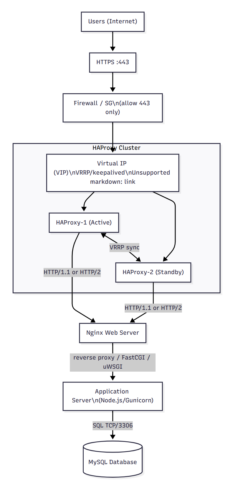

# Scale up

- Added 1 more server → dedicated roles:
  - Web server (Nginx): serves static assets, terminates or proxies HTTP, enables caching and connection reuse → offloads the app tier.
  - Application server (e.g., Node.js / Gunicorn): runs business logic → CPU-bound work is isolated and can scale independently.
  - Database server (MySQL): I/O-bound reads/writes, backups, tuning → isolation avoids resource contention with web/app.
- Added a second load balancer (HAProxy-2) and formed an HA cluster with VRRP/keepalived providing a VIP for www.foobar.com → removes the load balancer SPOF; if HAProxy-1 fails, traffic fails over to HAProxy-2 automatically.
- Split components into their own servers (web vs app vs DB) → independent scaling, clearer failure domains, simpler performance tuning, and improved security boundaries.

## Infrastructure specifics

- Second LB (HAProxy-2): high availability via VRRP VIP; seamless failover and maintenance without downtime.
- Web vs App split: Nginx handles static files, TLS/session reuse and caching; the app tier focuses on dynamic requests → better cache hit rates and lower app latency.
- Dedicated DB server: isolates disk/IO and buffer pool; safer backups, easier to add read replicas later; avoids noisy-neighbor effects from app/web workloads.